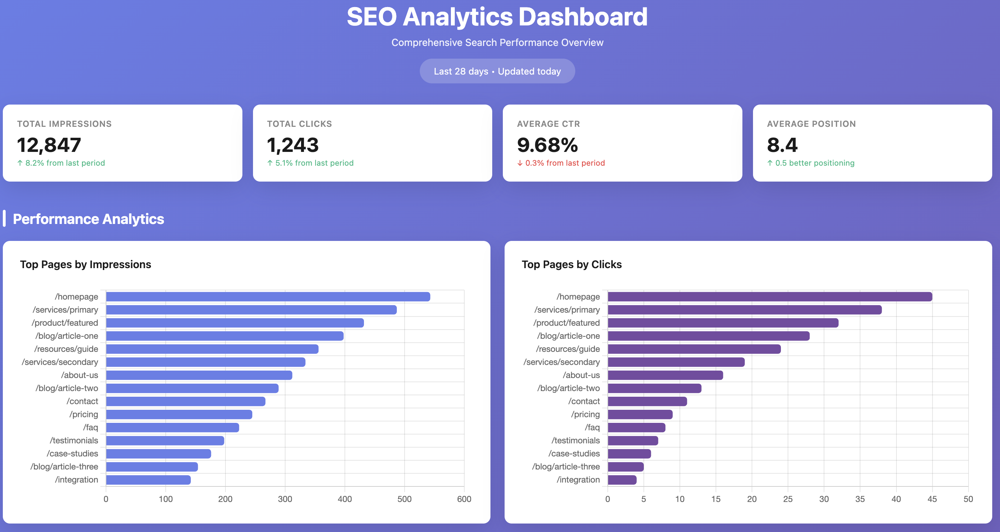
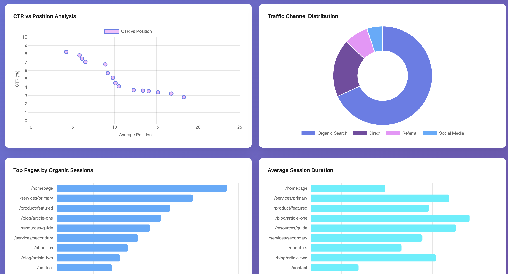
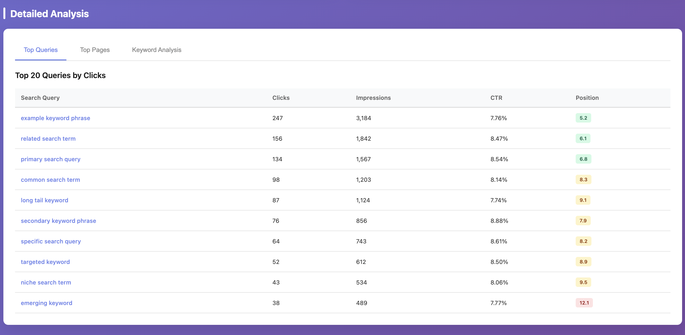

# SEO Analytics MCP

MCP server for Google Search Console (GSC) + Google Analytics 4 (GA4).

## How It Works

### What `.venv` Means

- `.venv` is this project's private Python environment.
- It contains its own Python interpreter and dependencies for this repo only.
- `run-local.sh` activates `.venv` so the MCP server runs with the correct package versions.

### What `stdio` Means

- `stdio` means the MCP client and server communicate through standard input/output streams.
- The client starts `run-local.sh`, sends tool requests in, and reads JSON responses out.
- No web server or HTTP endpoint is required for the default local setup.

1. Your MCP client (Claude/Codex) launches `run-local.sh` as a stdio server process.
2. `run-local.sh` prepares `.venv`, installs dependencies, loads `config/.env`, and validates `config/service-account.json`.
3. The Python server (`seo-analytics-mcp`) receives tool calls, fetches data from GSC/GA4 using the service account, and computes merged analysis outputs.
4. Results are returned to the MCP client as structured JSON.

## Deployment Model

- This project is deployed as a local process on your machine via stdio.
- It is not an HTTP API service by default and does not require cloud hosting.
- To "deploy" it for another environment, clone the repo there, provide `config/.env` and `config/service-account.json`, then register that machine's `run-local.sh` path in the MCP client.

## Prerequisites

- Python 3.11+

## Quick Start

1. Create local config files from templates:

```bash
cp config/.env.example config/.env
cp config/service-account.example.json config/service-account.json
```

2. Fill required values:
- `config/.env`
  - `DEFAULT_GSC_SITE_URL` (required format: `sc-domain:example.com`)
  - `DEFAULT_GA4_PROPERTY_ID`
- `config/service-account.json`
  - Replace all `REPLACE_WITH_...` fields with real Google service-account values.

3. Run the server:

```bash
./run-local.sh
```

The script creates/uses `.venv`, installs dependencies, loads `config/.env`, validates credentials, and starts `seo-analytics-mcp` over stdio.

## MCP Client Setup

Use the local launcher script as the MCP server command:

```text
/absolute/path/to/analytics/run-local.sh
```

### Codex App

Add server:

```bash
codex mcp add seo-analytics -- /absolute/path/to/analytics/run-local.sh
```

Verify:

```bash
codex mcp list
```

Remove:

```bash
codex mcp remove seo-analytics
```

### Claude Code CLI

Add server:

```bash
claude mcp add -s project seo-analytics -- /absolute/path/to/analytics/run-local.sh
```

Verify:

```bash
claude mcp list
```

Remove:

```bash
claude mcp remove seo-analytics
```

### Claude Desktop App (macOS)

1. Quit Claude Desktop completely.
2. Edit `~/Library/Application Support/Claude/claude_desktop_config.json`.
3. Add this server entry (merge into existing `mcpServers` if present):

```json
{
  "mcpServers": {
    "seo-analytics": {
      "type": "stdio",
      "command": "/absolute/path/to/analytics/run-local.sh",
      "args": []
    }
  }
}
```

4. Start Claude Desktop again.
5. In a new chat, run tool `capabilities` to confirm connection.

## Main Tools

- `capabilities`
- `gsc_list_sites`
- `gsc_top_pages`
- `gsc_top_queries`
- `ga4_landing_pages`
- `analytics_merge_page_metrics`
- `analytics_generate_action_items`
- `analytics_trend_report`
- `analytics_data_quality_report`

## Screenshots

These screenshots are example outputs produced by using Claude Code with this MCP server.
The MCP provides the underlying GSC/GA4 data and analytics tools; dashboard rendering is not generated by default by the server itself.
For privacy reasons, values shown in the screenshots are randomized; the actual workflow was executed against real data.





## Troubleshooting

- `service-account.json still contains placeholder values`
  - Replace all `REPLACE_WITH_...` fields in `config/service-account.json`.
- `No such file or directory: .../credentials/service-account.json`
  - You have a stale credential env override from an older setup.
  - Re-add the MCP server so it runs the latest `run-local.sh` and uses `config/service-account.json`.
- `Operation not permitted` when Claude Desktop starts MCP
  - macOS is blocking execution from protected folders (commonly `~/Documents`).
  - Either grant Claude Desktop access in `System Settings -> Privacy & Security` (`Files and Folders` and/or `Full Disk Access`) or move the repo to a non-protected path like `~/dev/analytics`.
  - After changing permissions/path, restart Claude Desktop and re-add the MCP entry if needed.
- `Missing property_id and DEFAULT_GA4_PROPERTY_ID is not set`
  - Set `DEFAULT_GA4_PROPERTY_ID` in `config/.env`.
- `Missing site_url...`
  - Set `DEFAULT_GSC_SITE_URL` in `config/.env`.
- GSC permission error on `https://...` property
  - This server enforces GSC properties in `sc-domain:<domain>` format to avoid URL-prefix mismatch issues.
  - Use a Domain property in Search Console and grant your service account access there.

## Security

- Never commit `config/service-account.json` or `config/.env`.
- Commit only template files:
  - `config/service-account.example.json`
  - `config/.env.example`
